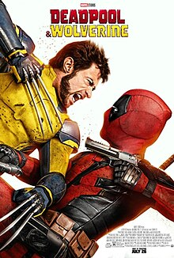

# My Summer in Markdown
## By Makayla Pulido
### **Introduction**
My name is Makayla and I am a 10th grader and I play flag football, wrestling, and softball.
### **Favorite Book or Movie**
My favorite movie I watched over the summer was Deadpool and Wolverine.

### **Favorite Summer Memory**
My favorite summer memory was when I went to Six flags with my friends. 

### **Goals for the School Year**
My goals for this school year is to at least get a 3 or higher on all my AP exams.
### **Volunteer Work or Community Service**
One thing I volunteered for over the summer was to clean up the beach. I learned that there was a lot more hidden trash in places people refuse to look and a lot of trash left behind gets stuck in the rocks.
